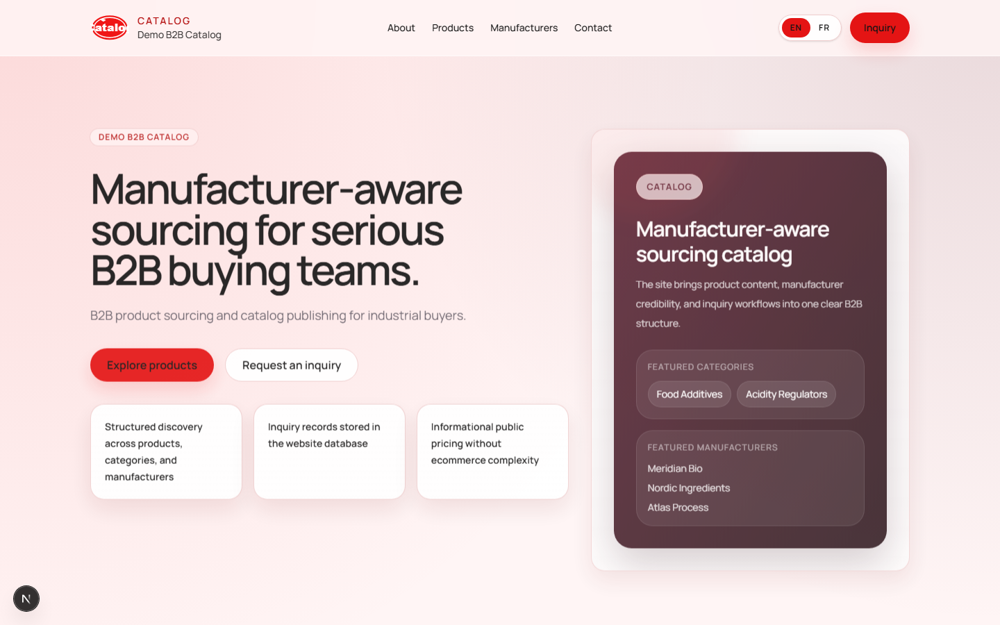

# B2B Catalog CMS

`B2B Catalog CMS` is the repository/project name for the public multilingual website and lightweight admin CMS of `Demo B2B Catalog` (`Catalog` for compact brand usage).

The public product remains the Catalog website. This repository is the implementation workspace for that website + CMS foundation.

## Screenshot

The repository ships synthetic catalog data for local demonstration. It does not represent a real company or customer deployment.

## Architecture and workflow

Next.js App Router serves locale-prefixed public pages and the protected admin workspace. Prisma maps pages, products, categories, manufacturers, media, inquiries, translations, and publication state to a local SQLite database. Public queries expose only published content; admin server actions require a valid signed session.

## Storage and deployment limits

SQLite and local file-backed media keep setup simple for a single local instance. They are not suitable for horizontally scaled or serverless production deployment without replacing the database and upload storage. Authentication is a single administrator boundary, not a multi-role identity system.

## Current Status

- Public catalog, editorial admin, publication controls, and inquiry workflows are implemented
- Public locales: `en`, `fr`
- Internal-only modeled locale: `fa`
- Inquiry persistence works locally without paid third-party services
- Admin CRUD foundation exists for pages, categories, manufacturers, products, media, inquiries, and settings
- SEO foundation exists: metadata, canonicals, hreflang, sitemap, robots, publication protections
- GitHub Actions CI verifies lint, typecheck, unit tests, and production build on push/PR

## What B2B Catalog CMS Includes

- public multilingual catalog website for `en` and `fr`
- lightweight admin CMS for pages, categories, manufacturers, products, media, inquiries, and settings
- local-safe inquiry persistence without paid third-party dependencies
- SEO and publication controls aligned to the specification package

## What B2B Catalog CMS Does Not Include

- cart, checkout, or online payment
- ecommerce ordering flow
- CRM integration in MVP
- supplier/reseller modeling in MVP
- public `fa` launch in MVP

## Quickest Local Start

### Windows

1. Double-click [RUN_ME_WINDOWS.bat](./RUN_ME_WINDOWS.bat)
2. Or run [RUN_ME_WINDOWS.ps1](./RUN_ME_WINDOWS.ps1)

The script will:

- create `.env` from `.env.example` if missing
- run `npm install`
- generate Prisma client
- sync the local database schema
- seed development data if the local DB is empty
- start Next.js on `http://127.0.0.1:3000`

To stop a background/local server on port 3000, run [STOP_LOCAL_WINDOWS.ps1](./STOP_LOCAL_WINDOWS.ps1) or [STOP_LOCAL_WINDOWS.bat](./STOP_LOCAL_WINDOWS.bat).

### macOS / Linux

Run [RUN_ME_MAC_LINUX.sh](./RUN_ME_MAC_LINUX.sh)

To stop the local server on port 3000, run [STOP_LOCAL_MAC_LINUX.sh](./STOP_LOCAL_MAC_LINUX.sh).

### Setup-only mode

If you want only dependency/database preparation without starting the dev server:

- Windows: `powershell -ExecutionPolicy Bypass -File .\RUN_ME_WINDOWS.ps1 -SetupOnly`
- macOS/Linux: `./RUN_ME_MAC_LINUX.sh --setup-only`
- npm: `npm run local:setup`

## Local URLs

- Public EN: `http://127.0.0.1:3000/en`
- Public FR: `http://127.0.0.1:3000/fr`
- Admin login: `http://127.0.0.1:3000/admin/login`

`npm run local:setup` generates strong per-checkout administrator credentials in the ignored `.env` file. The password is displayed once when generated; save it locally. Runtime authentication remains disabled if the required email, password, or signing secret is missing or weak.

## Implemented Stack

- Next.js App Router
- TypeScript strict mode
- Tailwind CSS
- Reusable shadcn-style primitives
- Prisma ORM
- SQLite for safe local MVP testing
- next-intl locale-prefixed routing
- Signed-cookie local-safe admin auth
- Vitest + Playwright

## Core Commands

- `npm run dev`
- `npm run build`
- `npm run lint`
- `npm run typecheck`
- `npm test`
- `npm run coverage`
- `npm run e2e`
- `npm run local:setup`
- `npm run local:start`
- `npm run db:push`
- `npm run db:seed`

## Major Product Constraints

- Official public company name: `Demo B2B Catalog`
- Compact brand form: `Catalog`
- `crm-platform` is not the public website brand
- MVP font: `Manrope`
- No ecommerce flow
- No cart / checkout / payment
- No CRM integration in MVP
- No supplier/reseller modeling in MVP
- Categories support multi-level hierarchy
- Products support manufacturer, category, availability, optional price, contact-for-pricing fallback, and documents
- Inquiries are stored in DB and manageable in admin
- `fa` is editable in admin but non-public and non-indexable

## Repository Layout

- `app/` App Router public + admin routes
- `components/` UI building blocks
- `lib/` domain, validation, SEO, i18n, public query helpers
- `prisma/` schema, migrations, seed
- `tests/` unit/integration-oriented tests
- `e2e/` Playwright coverage
- `docs/` authoritative spec package + implementation notes
- `public/` brand, catalog, and document assets

## Authoritative Docs

- [00_project_overview.md](./docs/00_project_overview.md)
- [03_sitemap.md](./docs/03_sitemap.md)
- [04_domain_model.md](./docs/04_domain_model.md)
- [05_multilingual_strategy.md](./docs/05_multilingual_strategy.md)
- [06_seo_strategy.md](./docs/06_seo_strategy.md)
- [07_ui_ux_spec.md](./docs/07_ui_ux_spec.md)
- [08_cms_spec.md](./docs/08_cms_spec.md)
- [09_technical_architecture.md](./docs/09_technical_architecture.md)
- [10_implementation_roadmap.md](./docs/10_implementation_roadmap.md)
- [12_acceptance_checklist_for_build_phase.md](./docs/12_acceptance_checklist_for_build_phase.md)
- [13_final_product_decisions.md](./docs/13_final_product_decisions.md)
- [14_release_readiness.md](./docs/14_release_readiness.md)

## Testing and licensing

CI runs lint, TypeScript checking, 69 unit/component tests, and the production build. Playwright remains a local browser suite until a stable CI database/browser setup is maintained. Package metadata explicitly marks the project `UNLICENSED`; source is visible for review and reuse rights are reserved.
